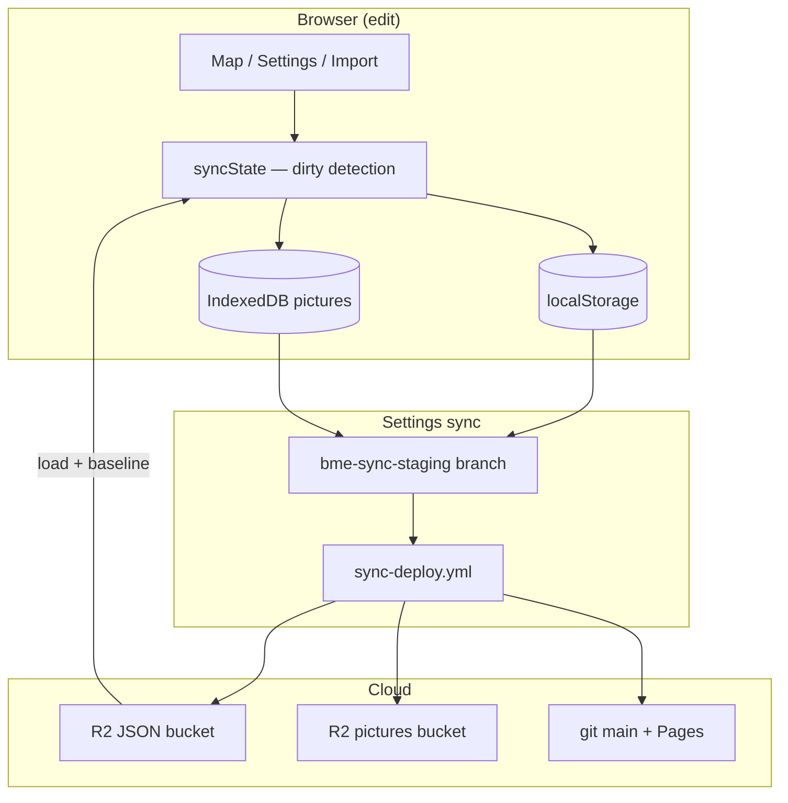

# Sync architecture

How map data moves between your browser, GitHub, Cloudflare R2, and GitHub Pages.

## Two deploy paths (do not mix them up)

| Path | How you trigger it | What it updates |
|------|-------------------|-----------------|
| **App deploy** | `npm run push-live` → Manual deploy workflow | React UI on GitHub Pages, version stamp, optional R2 JSON when data paths changed |
| **Map data deploy** | Settings → **Sync to Cloudflare & GitHub** | Portfolio JSON, RTU schedule, pricing, new RTU photos, documents manifest, sync-meta |

**While editing:** this browser’s `localStorage` + IndexedDB are the working copy.  
**After a successful Settings sync:** git `main`, R2 JSON bucket, and R2 picture/document buckets are authoritative for other browsers.

Pushing app code alone does **not** upload RTU pictures or portfolio edits from Settings. Syncing from Settings does **not** rebuild the React app.

## Data flow



### Settings sync (step by step)

1. You click **Sync to Cloudflare & GitHub** in Settings (GitHub PAT required; repo secret `BME_SYNC_PAT` for CI).
2. The app builds a deploy bundle (portfolio, schedule, pricing, picture chunks, document manifest deltas).
3. Bundle files are pushed to branch `bme-sync-staging` in this repo.
4. GitHub Actions runs `sync-deploy.yml`: applies the bundle, uploads to R2, commits JSON to `main`, deletes the staging branch.
5. On success, `syncState` records **fingerprints** of what was pushed so the unsynced banner reflects real edits only.

### App deploy (step by step)

1. Run `npm run push-live` (tests + typecheck, then triggers `manual-deploy.yml`).
2. CI builds the Vite app and deploys to GitHub Pages (`upload-pages-artifact@v4`, `deploy-pages@v4`).
3. If the commit touched `supabase/data/` or `public/database/`, CI may also sync JSON to R2.

## Dirty state (`src/lib/syncState.ts`)

The unsynced banner uses **fingerprints**, not stale flags:

- **Portfolio** — `portfolioSyncFingerprint` vs `lastPushedPortfolioFingerprint` (legacy `bme-portfolio-unsaved` only before first baseline).
- **Schedule / pricing** — same pattern; before the first baseline, in-session flags set by imports or store edits.
- **Pictures** — pending IndexedDB uploads vs Cloudflare manifest.
- **Hidden pictures / document links** — local overrides not yet in cloud manifests.

Baselines are updated when you:

- Successfully complete Settings sync (`recordSyncBaseline`)
- Load from Cloudflare (Settings pull, remote update modal, discard unsynced)

## Troubleshooting

### “Unsynced changes” banner won’t go away

1. **Confirm you synced, not just pushed code.** RTU photos live in IndexedDB until Settings sync.
2. **Hard refresh** after sync-deploy finishes (Ctrl+Shift+R).
3. **Load from Cloudflare** (Settings) if another PC pushed newer data — updates baselines.
4. **Discard local unsynced** if you want to drop this browser’s edits and match cloud.
5. If schedule/pricing still show after sync: check you didn’t re-import a workbook locally after syncing.

### Sync failed or bundle too large

Use the manual fallback in [HELP.md](../HELP.md#map--portfolio-data-changes):

```powershell
npm run apply-deploy-bundle
git add supabase/data public/database/rtu-pictures/manifest.json
git commit -m "chore: update portfolio data and RTU picture manifest"
git push origin main
```

### Cloud newer than your last push

Settings sync warns before overwriting if remote `sync-meta` is newer than your last successful push. Choose **Load from Cloudflare first** if unsure.

### Pictures missing online but visible locally

Manifest keys use short RTU names (e.g. `RTU-04 Hybrid`, not the long map label). Refresh once locally, confirm pictures, then Settings sync.

### GitHub token

PAT is **session-only by default**. Enable “Remember token on this computer” only on trusted machines. CI uses `BME_SYNC_PAT` for staging uploads; the workflow uses `GITHUB_TOKEN` to commit.

## Key files

| File | Role |
|------|------|
| `src/lib/syncState.ts` | Dirty detection, unsynced lines, baseline recording |
| `src/lib/githubDeploySync.ts` | Staging upload + workflow dispatch |
| `src/lib/deployBundle.ts` | Bundle assembly |
| `scripts/apply-deploy-bundle.mjs` | CI/local apply to R2 + git |
| `.github/workflows/sync-deploy.yml` | Map data deploy |
| `.github/workflows/manual-deploy.yml` | App deploy to Pages |

## Related docs

- [HELP.md](../HELP.md) — day-to-day commands, git workflow, push checklist
